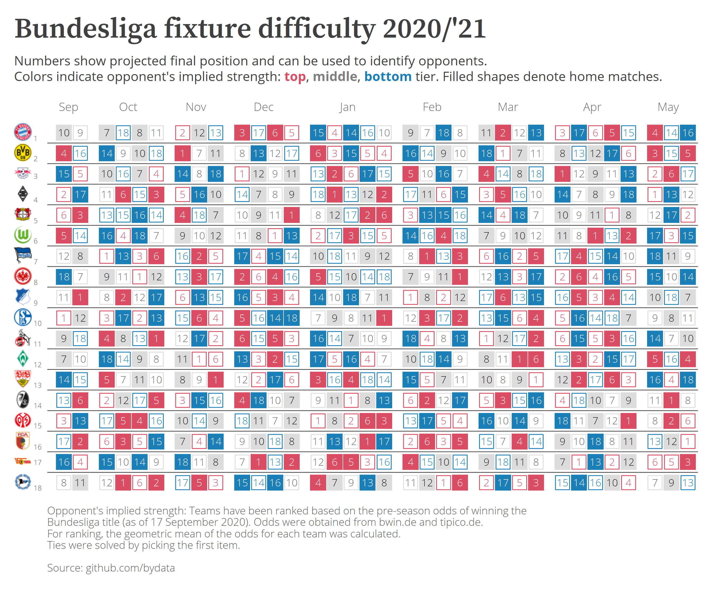
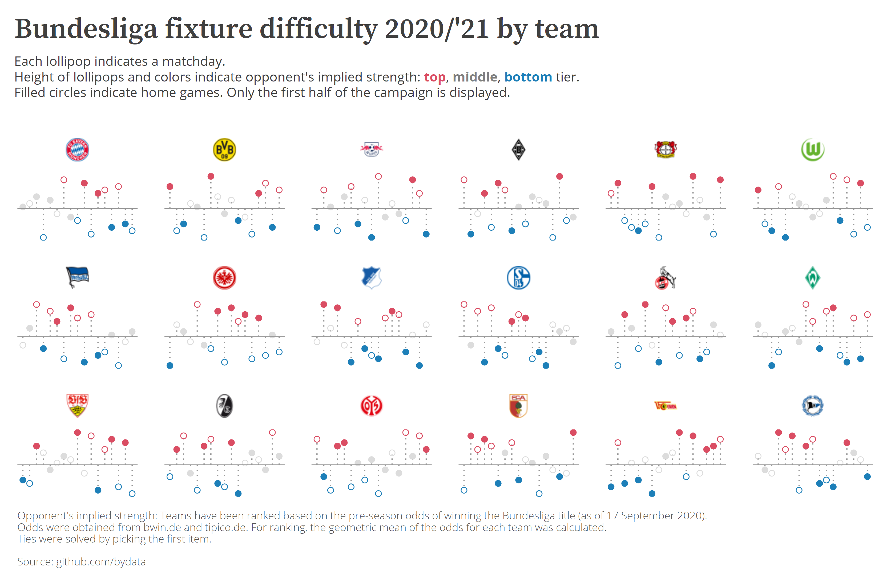
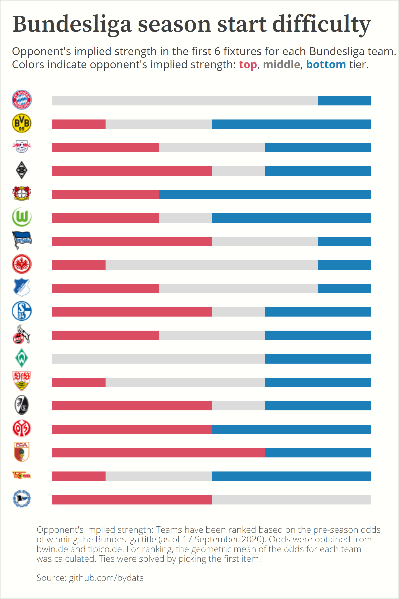

```{r setup, include=FALSE}
knitr::opts_chunk$set(echo = FALSE)
```

## Inspiration

When the fixtures for the 2020/'21 Premier League season were announced, football news outlet PA Dugout presented the schedule including opponent's implied strength:

<blockquote class="twitter-tweet"><p lang="und" dir="ltr">The fixtures are here!<a href="https://twitter.com/hashtag/PL?src=hash&amp;ref_src=twsrc%5Etfw">#PL</a> opening weekend<a href="https://twitter.com/BurnleyOfficial?ref_src=twsrc%5Etfw">@BurnleyOfficial</a> v <a href="https://twitter.com/ManUtd?ref_src=twsrc%5Etfw">@ManUtd</a><a href="https://twitter.com/CPFC?ref_src=twsrc%5Etfw">@CPFC</a> v <a href="https://twitter.com/SouthamptonFC?ref_src=twsrc%5Etfw">@SouthamptonFC</a><a href="https://twitter.com/FulhamFC?ref_src=twsrc%5Etfw">@FulhamFC</a> v <a href="https://twitter.com/Arsenal?ref_src=twsrc%5Etfw">@Arsenal</a><a href="https://twitter.com/LFC?ref_src=twsrc%5Etfw">@LFC</a> v <a href="https://twitter.com/LUFC?ref_src=twsrc%5Etfw">@LUFC</a> <a href="https://twitter.com/ManCity?ref_src=twsrc%5Etfw">@ManCity</a> v <a href="https://twitter.com/AVFCOfficial?ref_src=twsrc%5Etfw">@AVFCOfficial</a><a href="https://twitter.com/SpursOfficial?ref_src=twsrc%5Etfw">@SpursOfficial</a> v <a href="https://twitter.com/Everton?ref_src=twsrc%5Etfw">@Everton</a><a href="https://twitter.com/WBA?ref_src=twsrc%5Etfw">@WBA</a> v <a href="https://twitter.com/LCFC?ref_src=twsrc%5Etfw">@LCFC</a><a href="https://twitter.com/WestHam?ref_src=twsrc%5Etfw">@WestHam</a> v <a href="https://twitter.com/NUFC?ref_src=twsrc%5Etfw">@NUFC</a><a href="https://twitter.com/OfficialBHAFC?ref_src=twsrc%5Etfw">@OfficialBHAFC</a> v <a href="https://twitter.com/ChelseaFC?ref_src=twsrc%5Etfw">@ChelseaFC</a><a href="https://twitter.com/SheffieldUnited?ref_src=twsrc%5Etfw">@SheffieldUnited</a> v <a href="https://twitter.com/Wolves?ref_src=twsrc%5Etfw">@Wolves</a> <a href="https://t.co/juBByv7ts1">pic.twitter.com/juBByv7ts1</a></p>&mdash; PA Dugout (@PAdugout) <a href="https://twitter.com/PAdugout/status/1296356907024695302?ref_src=twsrc%5Etfw">August 20, 2020</a></blockquote> <script async src="https://platform.twitter.com/widgets.js" charset="utf-8"></script>

Implied strength was calculated on leading bookmakers' odds for winning the league title. And since the Bundesliga season kicks off this weekend, I thought I'd give it a try.


## Data sources and data wrangling

Bookmakers' odds for each team for winning the Bundesliga title were obtained from bwin.de and tipico.de (as of 17 September 2020). I calculated the geometric mean of the odds provided by the two bookmakers and ranked the teams according to their average odds of winning the title. Three tiers with 6 teams each were created based on these ranks.

Bundesliga fixtures were [scraped from dfb.de](https://github.com/bydata/football_data/blob/master/bundesliga_difficulty_2021/R/01_scrape_bundesliga_fixtures.R) using the R package `rvest`.

To re-create the fixture difficulty schedule for the Bundesliga season, I used `ggplot2` and the extension `ggtext` for `ggplot2`. `ggtext` allows for using HTML code within the plot (e.g. for the subtitle) and to include club emblems.


## Bundesliga difficulty schedule

**Amendments to original chart:**

* Home / away games highlighted with filled / hollow shapes instead of bold / plain print
* Used a bit of spacing to separate months visually.
* Club emblems instead of text labels
* Colors explained in the subtitle, getting rid of the extra legend

[](../plots/bundesliga_fixture_difficulty.png)
(Click image for a larger resolution)


## Bundesliga difficulty by team

In another attempt to plot each teams' season schedule I switched to a lollipop chart. On this chart, the height of the lollipops indicates the opponent's implied rank based on the bookmakers' odds. Rank 10 is the baseline. Opponents with a *superior* rank are placed *above the baseline*, those with a inferior rank are placed below the baseline. Home games are indicated with filled shapes.


[](../plots/bundesliga_fixture_difficulty_by_team_lollipop.png)
(Click image for a larger resolution)


## Bundesliga difficulty by team

The stacked bar chart focussed on the first 6 matches for each Bundesliga team.

```{r, out.width = "500px"}

```

## So what?

* Before meeting on matchday 7, both Bayern München and Borussia Dortmund will have rather easy schedule, with only the black and yellow competing against a team from the top 6 (Gladbach).
* Expect Bayern to have 18 points and 24 to 0 goals after the first 6 matches. 
* Augsburg might have a hard time kicking off the season with fixtures against 4 team from the top tier.
* Bielefeld is looking ahead to a hard season start with no matchups against other bottom tier teams and 3 fixtures against teams from the top 6 of the league.
* Werder Bremen might be quite lucky with their fixtures.
* Schalke will match up with 3 top tier teams in their first 6 matches. Except some Schalke doing Schalke things.
* Union Berlin will face a challenging season finale - 5 of their last 7 opponents are from the top tier.

## Code

The R code for creating these plots can be found here: [03_bundesliga_difficulty_chart.R](https://github.com/bydata/football_data/blob/master/bundesliga_difficulty_2021/R/03_bundesliga_difficulty_chart.R).

<br><br><br>

