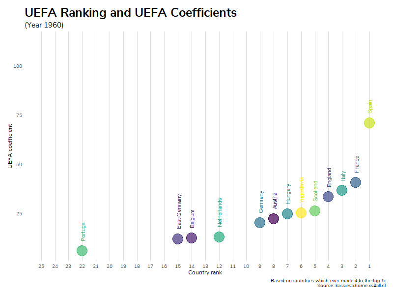

# UEFA coefficients animated

## Data source

Country rankings and coefficients were scraped from https://kassiesa.home.xs4all.nl/bert/uefa/data/index.html using the ``rvest`` package.

## Animations

### Rankings and coefficients over time

Animated graphs were created using ``gganimate``.

Limited to countries which ever made it to the annual top 5 in order to reduce the number of items displayed on the chart. Before 1990, West German Bundesliga is labelled Germany.

### Top 10 from 1960 to 2019

