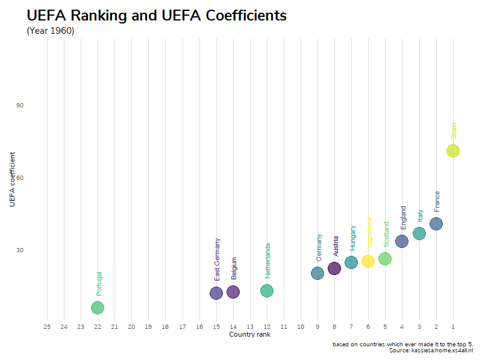

UEFA coefficients animated
==========================

Data source
-----------

Country rankings and coefficients were scraped from
<a href="https://kassiesa.home.xs4all.nl/bert/uefa/data/index.html" class="uri">https://kassiesa.home.xs4all.nl/bert/uefa/data/index.html</a>
using the `rvest` package.

Rankings and coefficients over time
-----------------------------------

Animated graphs were created using `gganimate`.

Limited to countries which ever made it to the annual top 5 in order to
reduce the number of items displayed on the chart.

